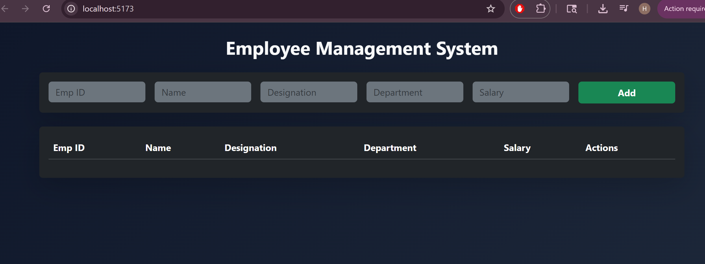
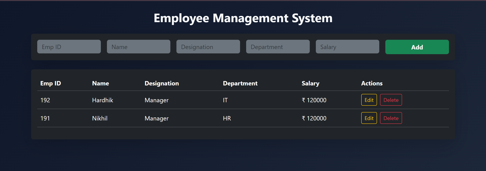
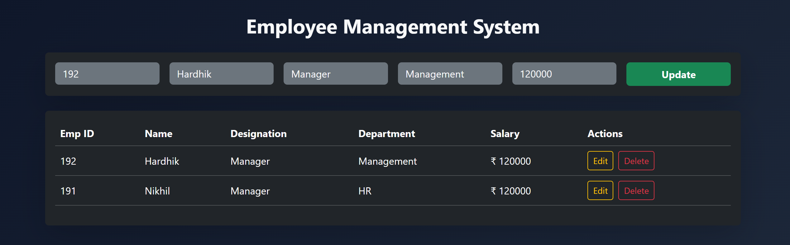
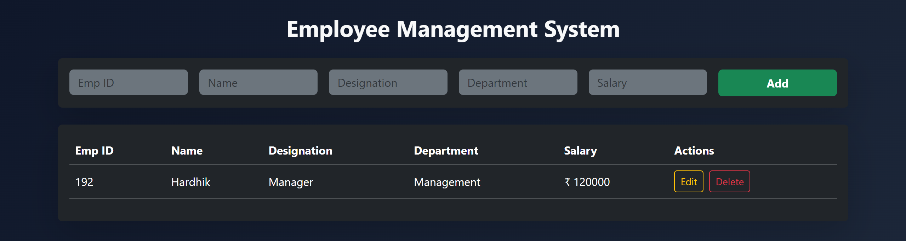

# Employee Management System

## Description

This project is a web-based Employee Management System developed using Vue.js. It performs CRUD (Create, Read, Update, Delete) operations by integrating with MockAPI using Axios. The application uses Bootstrap for a responsive and clean dark-themed user interface.

---

## Features

* Add new employee records
* View employee list in a table
* Update employee details
* Delete employee records
* Responsive UI using Bootstrap
* API integration using Axios

---

## Technologies Used

* Vue.js (Vite)
* Axios
* MockAPI
* Bootstrap

---

## Project Structure

```
employee-management/
│
├── public/
├── src/
│   ├── components/
│   │   ├── EmployeeForm.vue
│   │   └── EmployeeTable.vue
│   ├── services/
│   │   └── api.js
│   ├── App.vue
│   └── main.js
│
├── index.html
├── package.json
├── vite.config.js
└── README.md
```

---

## API Endpoint

Replace with your actual MockAPI endpoint:

```
https://69f8b6def7044aa0103e5f06.mockapi.io/employees
```

---

## How to Run the Project

1. Clone the repository:

```
git clone https://github.com/Hardhik-007/employee-management-192.git
```

2. Navigate to the project folder:

```
cd employee-management
```

3. Install dependencies:

```
npm install
```

4. Run the development server:

```
npm run dev
```

5. Open in browser:

```
http://localhost:5173/
```

## Screenshots

### Add Employee


### View Employees


### Update Employee


### Delete Employee

---

## Learning Outcome

* Understanding of Vue.js component-based architecture
* Implementation of CRUD operations using Axios
* Working with REST APIs (MockAPI)
* Building responsive user interfaces using Bootstrap

